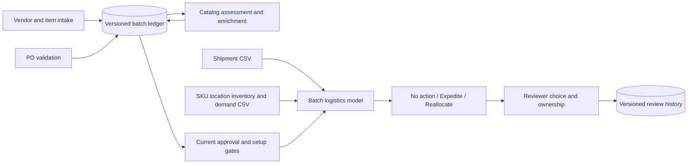

# Architecture and decision contracts

## Canonical entities

| Entity | Key | Links and contract |
|---|---|---|
| Batch | batch ID | Named launch scope shared by workbenches |
| Vendor request | batch, vendor ID | Versioned source; separate Finance review |
| Item request | batch, SKU | Vendor ID; mandatory setup, then Catalog content |
| PO request | batch, request identity | SKU, Vendor, Category and Gender must reconcile |
| Assessment / approval | request, version, evidence basis | Cannot authorize a different source revision |
| Shipment | shipment ID | SKU and destination must match uploaded inventory; destination must use the PO location code |
| Inventory | SKU, location | Opening units, constant daily demand, safety reserve and transfer terms |
| Logistics input | batch | Launch date, horizon and paired input files; replacement changes the evidence fingerprint |
| Recommendation review | batch, evidence fingerprint, SKU, option | Append-only accept/reject/defer/override with reviewer, owner, deadline and justification |

## Uploaded model boundaries

Policy `uploaded-logistics-1.0` requires INR, finite nonnegative inputs, integer units/days, 1–31 days, full SKU coverage and consistent positive cost/retail across each SKU’s PO lines. Inbound quantities cannot exceed that SKU’s total batch PO quantity. All PO lines for a SKU must satisfy the existing execution gates before logistics actions are available. Mixed-ready lines of the same SKU conservatively hold that SKU.

Arrival = promised day offset + observed milestone delay, reduced by the offered expedite days (floor day zero). Receipts precede daily sales. Unmet demand is lost, not backordered. Transfer stock leaves on day zero and arrives after the donor’s lead time. Only opening donor surplus after reserving the entire demand horizon and safety stock is available. One candidate donor transfer is compared with expediting delayed shipments and doing nothing; combinations and global network optimization are not implemented.

The recommendation maximizes modeled net margin among these feasible individual candidates, with no action winning ties. Revenue and net-margin deltas use the same baseline; mutually exclusive options must not be added together. A +20% demand stress test reports the alternative winner and whether the chosen transfer still protects the donor reserve. It is not statistical confidence or a forecast-quality score. Capacity, cancellation penalties, tax, returns, replenishment and transport reliability are not modeled.

## Failure and retry behavior

Invalid logistics uploads are validated before replacement; the previous input remains. Unknown keys, duplicate positions/shipments, mixed currency, missing numbers and ambiguous SKU prices fail explicitly. New source events or changed logistics inputs invalidate the current status of old recommendation reviews. Review writes check the evidence fingerprint inside a transaction; a stale or infeasible accepted/overridden option is rejected. Reviews never dispatch transport or override Finance/item/PO controls. Recording the same decision twice creates two visible review events; it is not an external execution retry.

Existing Catalog handoffs retain failed attempts for retry; source revisions and evidence bases prevent stale approvals/receipts from being reused. Readiness and simulated execution remain separate.

## Security and deployment limitations

This is an unauthenticated local prototype, not an enterprise approval service. Reviewer names are assertions, not verified roles. Do not upload company data into the public demo. SQLite and runtime logs are excluded from Git. No API credentials are required. Spreadsheet exports preserve formula-like source values as text. The local server binds to loopback. Public demo state is session-scoped; uploaded logistics currently belongs to the local batch workflow, not the hosted guided demo.

Direct Python dependencies are pinned; transitive dependencies are not a full hash-locked environment. CI runs syntax checks, fatal-error linting, app tests, branch/line coverage reporting and a generated-data benchmark. Coverage is evidence of executed code, not proof of correctness; UI and subprocess coverage are incomplete. No Kubernetes or microservices are needed for this demonstration.
